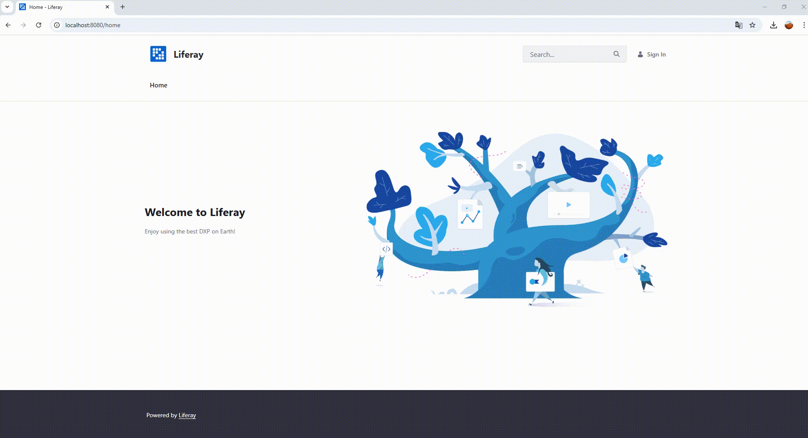
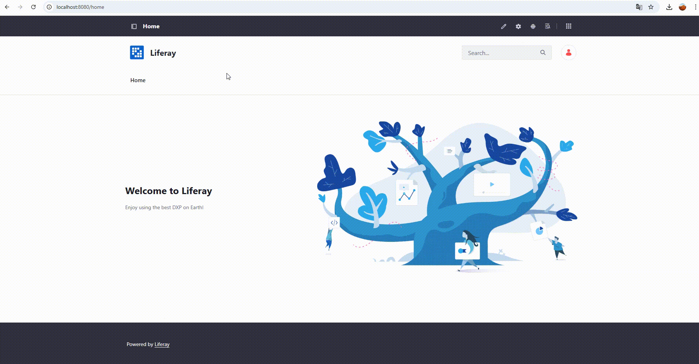

# 📝 To-Do List Workspace

Este projeto fornece um ambiente de desenvolvimento completo que integra **Liferay Portal** e **MySQL**, utilizando **Docker Compose**. Ele serve como base para o desenvolvimento de aplicações e portlets no Liferay.

---

## 📋 Requisitos

- **Java 17 ou superior**
- **Docker** e **Docker Compose**

> 💡 No **Windows**, apenas o Docker Desktop e o Java 17+ são necessários.

---
## ⚙️ Compilando e Fazendo Deploy dos Módulos

Após o Liferay estar em execução:

1. **Compilar os Módulos**
 - **Build Automático**
  - Acesse a pasta `to-do-list-workspace/start`:
    - **Linux:**
       ```bash
       ./build-modulos.sh
       ```
     - **Windows:**
        ```bash
       build-modulos.bat
       ````
 - **Build Manual**
  - Acesse a pasta `to-do-list-workspace`:
    ```bash
    cd /to-do-list-workspace
    ```
  - Compile utilizando Gradle:
    ```bash
    .\gradlew.bat build
    ```
 - Se utilizar o IntelliJ IDEA, você também pode usar as tasks do Gradle disponíveis na interface.
 - 

2. **Fazer o Deploy**
 - Após a compilação, copie os arquivos `.jar`/`.war` gerados (geralmente localizados na pasta `build/libs` de cada módulo).
 - Coloque-os na pasta `/to-do-list-workspace/start/deploy`.
 - O Liferay detectará automaticamente os novos módulos e realizará o deploy.
 - 

---
## 🚀 Iniciando o Ambiente

1. **Preparação**
   - Certifique-se de que o Docker, Docker Compose e o Java 17+ estejam instalados.

2. **Subindo os Containers**
   - Navegue até a pasta `start` na raiz do projeto e execute o script correspondente ao seu sistema operacional:
     - **Linux:**
       ```bash
       ./start.sh
       ```
     - **Windows:**
         ```bash
        start.bat
       ```

   - Esses scripts utilizam o arquivo `docker-compose.yml` para iniciar os containers.
   -  **Observação: Acidionei no `start` o script `build-modulos` ele ja faz o build dos modulos e o deploy automaticamente utilizando caminho relativo**
   - 

3. **Aguardando o Liferay**
   - O container do Liferay aguarda 60 segundos antes de iniciar, garantindo que o banco de dados esteja pronto.

4. **Acessando o Liferay**
   - Acesse [http://localhost:8080](http://localhost:8080) em seu navegador.
   - Use as credenciais padrão:
     - **Usuário:** `test@liferay.com`
     - **Senha:** `test`

5. **Configurações Iniciais do Portal**
   - Para permitir o cadastro de novos usuários, desative a verificação de e-mail:
     - Acesse o painel administrativo com o usuário padrão.
     - Vá para:  
       `Control Panel → Instance Settings → User Authentication → General`
     - Desmarque a opção:  
       `Require strangers to verify their email address?`
   - 

6. **Exibindo o Portlet**
   - Para visualizar o ToDoList na página inicial:
     - Acesse: [http://localhost:8080/home](http://localhost:8080/home)
     - Clique em `Edit` (canto superior direito)
     - Clique em `Browser` (canto superior esquerdo)
     - Remova a `Grid` existente
     - Vá em **Fragmentos e Widgets** → **Widgets** → **Sample**
     - Arraste o `ToDoListWidget` para dentro do container da página
     - Clique em `Publish` para salvar
   - 

---

## 🐳 Containers e Serviços

### MySQL

- **Imagem:** `mysql:8.0.36`
- **Container Name:** `liferay-db`
- **Porta:** `3306`
- **Configurações:**
  - `MYSQL_ROOT_PASSWORD=sa`
  - `MYSQL_DATABASE=lportal`
  - `MYSQL_ROOT_HOST=%`
- **Comando Extra:**  
  Garante compatibilidade com clientes antigos e define charset/collation: `--default-authentication-plugin=mysql_native_password --character-set-server=utf8mb4 --collation-server=utf8mb4_unicode_ci`
- **Volume:** `liferay_db_data`
- **Rede:** `liferay-net`

### Liferay Portal

- **Imagem:** `liferay/portal:7.4.3.132-ga132`
- **Container Name:** `liferay-portal`
- **Porta:** `8080`
- **Volumes:**
- `liferay_data` (dados persistentes)
- `./deploy` (hot deploy de módulos)
- `../portal-setup-wizard.properties` (configuração inicial)
- **Dependência:** Inicia somente após o banco de dados estar ativo (`depends_on`)
- **Entrypoint Personalizado:**  
Aguarda 60 segundos e inicia o servidor Tomcat do Liferay com uma mensagem de log.

---


## 🔧 Personalizações e Dicas

- **Configurações do Liferay:**  
Personalize o arquivo `portal-setup-wizard.properties` conforme necessário para ajustes iniciais no portal.

- **Hot Deploy:**  
Coloque os módulos compilados na pasta `./deploy` para que o Liferay os implante automaticamente.

- **Compatibilidade com MySQL:**  
A opção `--default-authentication-plugin=mysql_native_password` é utilizada para manter compatibilidade com clientes que ainda usam este método de autenticação.

- **Gifs de Apoio**  
Separei alguns gifs em /assest para poder auxiliar na inicialização do ambiente.
---


