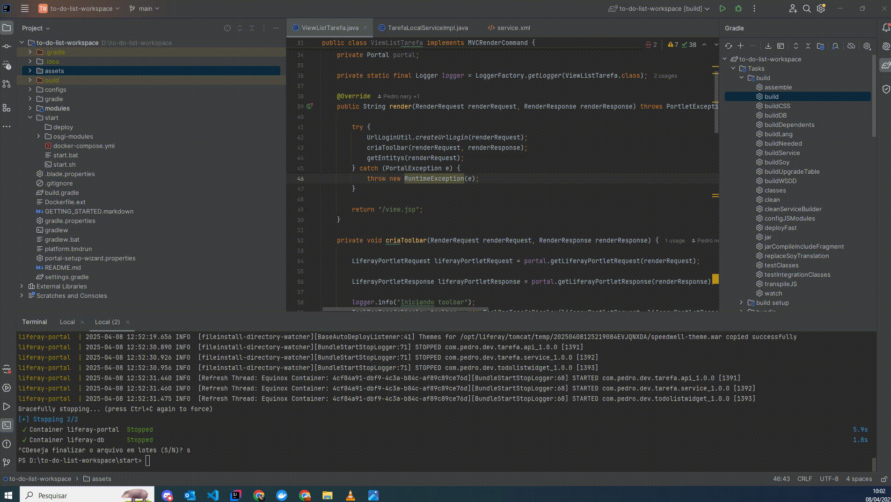
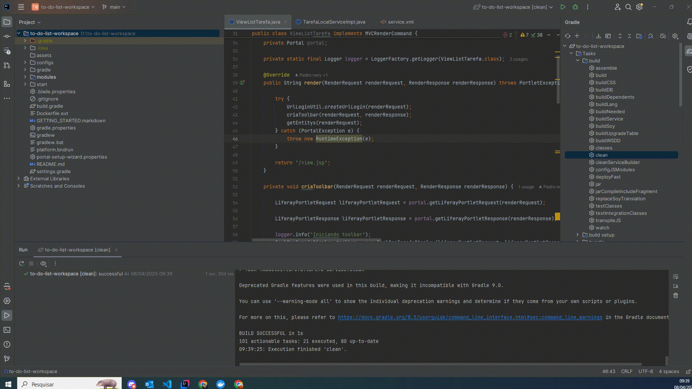
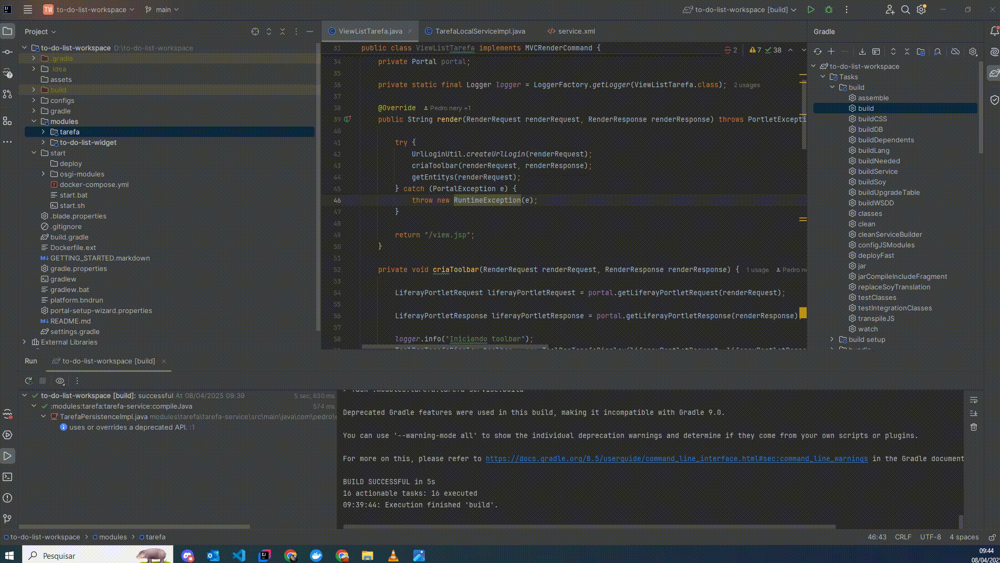

# 📝 To-Do List Workspace

Este projeto é um ambiente de desenvolvimento que integra **Liferay Portal** e **MySQL** utilizando **Docker Compose**. Ele serve como base para o desenvolvimento de aplicações e portlets no Liferay.

---

## 📋 Requisitos Necessários

- **Java 17+**
- **Docker** e **Docker Compose**

---

## 🚀 Como Iniciar o Ambiente

1. **Preparação:**
   - Certifique-se de ter o Docker, Docker Compose e Java 17+  instalados.

2. **Subir os Containers:**
   - Na raiz do projeto, navegue até a pasta `start` e execute o script adequado para seu sistema:
     - Em **Linux**:  
       ```bash
       /to-do-list-workspace/start/start.sh
       ```
     - Em **Windows**:  
       Execute o arquivo `/to-do-list-workspace/start/start.bat`

   - Esses scripts iniciarão o ambiente utilizando o arquivo `docker-compose.yml`.
   - 
3. **Aguardando o Liferay:**
   - O container do Liferay aguarda 60 segundos antes de iniciar, garantindo que o banco de dados esteja pronto.

4. **Acessar o Liferay:**
   - Abra seu navegador e acesse: [http://localhost:8080](http://localhost:8080)
   - As credenciais de acesso ficam definidas no arquivo `portal-setup-wizard.properties`.

---

## 🐳 Serviços e Configurações dos Containers

### MySQL (Banco de Dados)
- **Imagem:** `mysql:8.0.36`
- **Container Name:** `liferay-db`
- **Configurações:**
  - `MYSQL_ROOT_PASSWORD: sa`
  - `MYSQL_DATABASE: lportal`
  - `MYSQL_ROOT_HOST: '%'`
- **Porta:** 3306 (mapeada para a mesma porta no host)
- **Comando Adicional:**
  - Força o uso do `mysql_native_password` e define o charset e collation:
    ```
    --default-authentication-plugin=mysql_native_password --character-set-server=utf8mb4 --collation-server=utf8mb4_unicode_ci
    ```
- **Volume:** `liferay_db_data` (para persistência dos dados)
- **Rede:** `liferay-net`

### Liferay Portal
- **Imagem:** `liferay/portal:7.4.3.132-ga132`
- **Container Name:** `liferay-portal`
- **Porta:** 8080 (mapeada para a mesma porta no host)
- **Volumes:**
  - `liferay_data` para dados persistentes
  - `./deploy` para hot deploy de plugins/portlets
  - `../portal-setup-wizard.properties` para configuração inicial
- **Dependência:** Inicia somente após o container do banco estar ativo (`depends_on: database`)
- **Entrypoint:**
  - Exibe a mensagem "Aguardando 1 minuto antes de iniciar o Liferay...", aguarda 60 segundos e, em seguida, inicia o servidor Tomcat do Liferay.

---

## ⚙️ Compilação e Deploy dos Módulos

Após a instância do Liferay estar em execução:

1. **Compilar os Módulos:**
   - Navegue até a pasta `módulos`:
     ```bash
     cd /to-do-list-workspace/modulos
     ```
   - Execute o comando de build utilizando Gradle:
     ```bash
     gradle build
     ```
  - Ou se estiver utilizando o Intellij idea ele pode compilar utilizando as tasks do gradle que fica no canto superior direito
   - 
2. **Deploy dos Módulos:**
   - Após a compilação, para cada módulo, localize os arquivos gerados na pasta `/to-do-list-workspace/modulos/tarefa/build/lib`.
   - Arraste (ou copie) os arquivos `.jar`/`.war` para a pasta `/to-do-list-workspace/start/deploy`.
   - O Liferay detectará automaticamente os novos módulos e fará o deploy.
   - 

---

## 🔧 Personalizações e Considerações

- **Configurações do Liferay:**  
  As configurações iniciais podem ser ajustadas no arquivo `portal-setup-wizard.properties`.

- **Hot Deploy:**  
  Coloque seus módulos na pasta `./deploy` para que o Liferay faça o deploy automaticamente.

- **Compatibilidade MySQL:**  
  A opção `--default-authentication-plugin=mysql_native_password` é usada para manter compatibilidade com clientes que ainda utilizam este método de autenticação.


